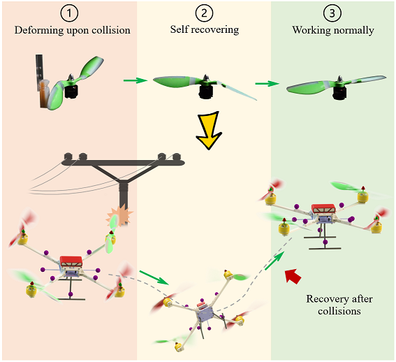

## _Tombo_ Propeller: Bio-Inspired Deformable Structure toward Collision-Accommodated Control for Drones
The repository includes Tombo propeller modeling programs and ROS packages for controlling (s500) drone embedded with TOMBO propeller and implementation of equilibrium bounce reaction strategy in respond to mid-air collision between the deformable propeller and a fixed obstacle.



## Documentation
### Aerodynamic modeling
1. Tombo_aerodynamic_model.m : areodynamic Matlab function for 9inch-TOMBO propeller

2. aeorodynamic_parameters.m : a program for generating aerodynamic parameters

3. Airfoil.csv : airfoil data includes the coordinates of leading edge and trailing edge and pitch angle of all corss-sections

4. Camberline.dat: camberline data of the _representative cross-section_

### Setup motion capture system (MOCAP):

Please be assure turn off Firewall for rigid-body data communication.

### Flight test - Trajectory Tracking:

1. Move to Catkin workspace (ROS) working directory.

```
$ cd [home/username]/catkin_ws/src
```
Then make the catkin environment and source the setup file.
```
$ catkin_make && source devel/setup.bash
```

2. Run vrpn node for subscribing drone pose (position and orientation) in real-time, pass the ip address of the computer running the MOCAP system to server argument.
```
$ roslaunch vrpn_client_ros sample.launch server:=192.168.11.13
```

3. Run mavros node to connect to the drone (PX4 flight stack) and Qground control

4. Relay orientation topic.

### Equilibrium Bounce Reaction Strategy:

## Contact
- Project Manager
	- Ho Anh Van - [van-ho@jaist.ac.jp](mailto:van-ho@jaist.ac.jp)
- Developers
  - Luu Khanh Quan - [quan-luu@jaist.ac.jp](mailto:quan-luu@jaist.ac.jp) : Flight and Reaction Control
  - Bui Tien Son - [son-bui@jaist.ac.jp](mailto:son-bui@jaist.ac.jp) : Aerodynamic modeling

## Acknowledgments
This work was supported by JST SCORE project, Grant-in-aid for Scientific Research projects No. 18H01406 and 21H01287

## License
Distributed under the MIT License. See `LICENSE` for more information.
